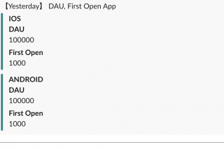

# gas-slackbot-bigquery-data
SlackBot for monitoring BigQuery data in Slack run on Google Apps Script(GAS).  

This repository uses [clasp(Command Line Apps Script Projects)](https://developers.google.com/apps-script/guides/clasp).

## Example
```typescript
  const queryRunner = new QueryRunner(Properties.bigQueryProjectId, Bigquery);
  const rows = queryRunner.query(`
    #StandardSQL
    SELECT
      platform
      ,count(distinct(user_pseudo_id)) as dau
      ,sum(case when event_name = "first_open" then 1 else 0 end) as first_open_count
    FROM
      \`${Properties.bigQueryTableName}_*\`
    WHERE
      _TABLE_SUFFIX = FORMAT_DATE("%Y%m%d", DATE_ADD(CURRENT_DATE(),  interval - 1 day))
    GROUP BY
      platform  
    ORDER BY 
      platform DESC  
    `);

  const attachments: MessageAttachment[] = rows.map(row => {
    return {
      title: row["platform"],
      color: "#008080",
      fields: [
        {
          title: "DAU",
          value: row["dau"],
        },
        {
          title: "First Open",
          value: row["first_open_count"],
        },
      ],
    };
  });

  const message: ChatPostMessageArguments = {
    channel: "",
    text: `【Yesterday】 DAU, First Open App`,
    attachments,
  };

  Slack.postMessage(Properties.slackWebhookUrl, message);
}
```

*Success!*  


## Starting
`yarn install`

### Setup clasp
install clasp  
`yarn global add clasp` or `npm i -g clasp`  

setup clasp  
`clasp login`

### Setting your Project Properties on GAS
Set GAS Project Properties to use [Properties Service](https://developers.google.com/apps-script/reference/properties)

- SLACK_WEBHOOK_URL  
slack incoming webhook to post message
- BIGQUERY_PROJECT_ID  
your BigQuery Project ID
- BIGQUERY_TABLE_NAME  
your BigQuery Table  eg.) analytics_xxxxxxxxxx.events


`.clasp.json`  
```json
{
  "scriptId": "{your_script_id}",
  "rootDir": "src"
}
```

## Deploy
`clasp push`
